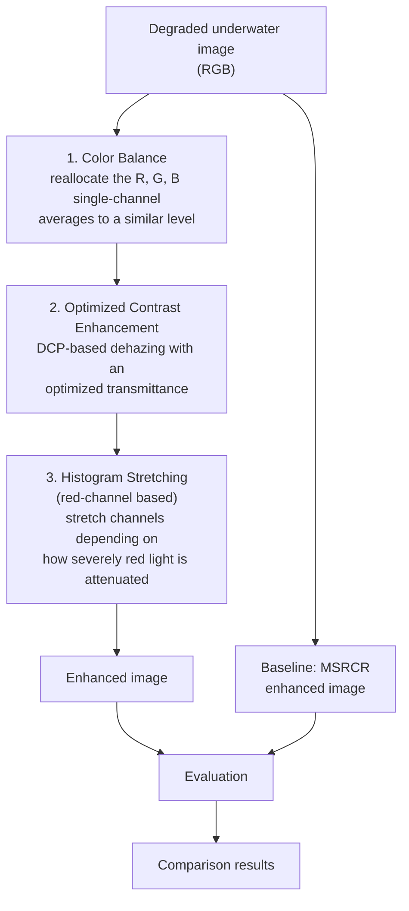

# Underwater Image Restoration and Enhancement: Color Balance, Optimized Contrast, and Histogram Stretching


A Python implementation of the three-stage fusion algorithm proposed in Luo et al., *"Underwater Image Restoration and Enhancement Based on a Fusion Algorithm With Color Balance, Contrast Optimization, and Histogram Stretching,"* IEEE Access, 2021 (see [Reference](#reference)).

## Table of Contents

- [Why underwater images need enhancement](#why-underwater-images-need-enhancement)
- [Architecture and workflow](#architecture-and-workflow)
- [Pipeline stages](#pipeline-stages)
- [Metrics used when comparing with MSRCR](#metrics-used-when-comparing-with-msrcr)
- [Tech stack](#tech-stack)
- [Getting started](#getting-started)
- [Reference](#reference)
- [License](#license)

## Why underwater images need enhancement

Underwater images are central to object localization, marine life recognition, underwater archaeology, environment monitoring, and search and salvage. But light behaves very differently underwater than in air, which degrades images in specific ways:

- **Color shift.** Water attenuates different wavelengths of light at different rates, so captured images lose their natural color balance.
- **Blur and reduced contrast.** Scattering of light as it travels through water softens detail and flattens contrast.
- **Noise.** Suspended particles and dissolved organisms cause additional noise, including a specific underwater phenomenon called marine snow, white blobs caused by biological or mineral particles that amplify backscattering.

Specialized hardware such as underwater lidar or laser line scan systems can capture clearer images directly, but the equipment is expensive. Software-based image processing is a lower-cost alternative. Existing single-technique methods such as histogram equalization, wavelet transforms, and retinex algorithms each enhance underwater images to some degree, but each has a known weakness on its own, for example, histogram equalization can lose image detail during enhancement, and retinex can introduce a halo effect in high-brightness areas. This project implements a **fusion algorithm** that combines three complementary techniques specifically to work around these individual shortcomings.

## Architecture and workflow

The pipeline runs three stages in sequence, then the enhanced output is compared against an MSRCR baseline.




## Pipeline stages

| # | Stage | Problem it addresses | Technique |
|---|-------|----------------------|-----------|
| 1 | Color Balance | Different wavelengths of light attenuate at different rates underwater, causing a color cast | Reallocates the average value of the R, G, and B channels to a shared level |
| 2 | Contrast Enhancement | Low contrast and haze from light scattering | Pillow's `ImageEnhance.Contrast`, scaling every pixel further from the image's average brightness by a fixed factor |
| 3 | Histogram Stretching (red-channel based) | Remaining low brightness and contrast after dehazing | Stretches channel histograms based on how severely the red channel has attenuated |

### 1. Color Balance

Red light attenuates fastest and over the shortest distance underwater, while blue and green travel further, so underwater images skew green-blue. This stage calculates the average value of each channel (R, G, B), then the overall average of those three numbers, and shifts each channel by the difference between its own average and the overall average. This brings all three channels to a similar level, correcting the color cast.


### 2. Contrast Enhancement

The reference paper's second stage is a fairly involved dehazing method: it estimates the background light with a quadtree region search and solves for an optimal transmittance by minimizing a combined contrast and information-loss cost function. **This implementation uses a simpler approach instead**, applying Python's Pillow library directly to the color-balanced image

### 3. Histogram Stretching Based on Red Channel

Because red light is the first and most severely attenuated underwater, stretching it carelessly can overcompensate and distort the image, a common problem the paper notes in other enhancement methods. This stage measures the average red-channel value and compares it to a threshold:

- If red attenuation is **slight**, all three channels (R, G, B) are histogram-stretched.
- If red attenuation is **heavy**, only the G and B channels are stretched, and the R channel is left untouched to avoid introducing further distortion.

## Metrics used when comparing with MSRCR

This implementation is compared against the existing MSRCR (Multi-Scale Retinex with Color Restoration) method using two metrics:

| Metric | In plain English |
|--------|-------------------|
| **PSNR** | How close the enhanced image is to a reference image. A higher number means less noise or distortion was introduced while enhancing it. |
| **SSIM** | Whether the shapes, edges, and patterns in the image still look natural after enhancement, rather than just checking colors and brightness. A higher score means the structure of the image was preserved well. |

## Tech stack

- **Python 3**
- **OpenCV** for image processing
- **NumPy** for array and numerical operations
- **Matplotlib** for plotting metric comparisons
- **Jupyter Notebook** for the implementation and experiments

## Getting started

```bash
# 1. Clone the repository
git clone https://github.com/<your-username>/<repo-name>.git
cd <repo-name>

# 2. (Optional) create a virtual environment
python -m venv venv
source venv/bin/activate        # Windows: venv\Scripts\activate

# 3. Install dependencies
pip install opencv-python numpy matplotlib jupyter

# 4. Launch the notebook
jupyter notebook
```

Open the notebook, point it at your underwater image(s), and run the cells in order. Each stage of the pipeline (color balance, optimized contrast enhancement, histogram stretching) is a separate step so you can inspect the intermediate result.

## Reference

This project implements the method proposed in:

> W. Luo, S. Duan, and J. Zheng, "Underwater Image Restoration and Enhancement Based on a Fusion Algorithm With Color Balance, Contrast Optimization, and Histogram Stretching," *IEEE Access*, vol. 9, pp. 31792–31804, 2021. doi: [10.1109/ACCESS.2021.3060947](https://doi.org/10.1109/ACCESS.2021.3060947)

The paper is published open access under a [Creative Commons Attribution 4.0 License (CC BY 4.0)](https://creativecommons.org/licenses/by/4.0/). This repository does not reproduce any figures from the paper; only the described method is implemented here.

## License

MIT
